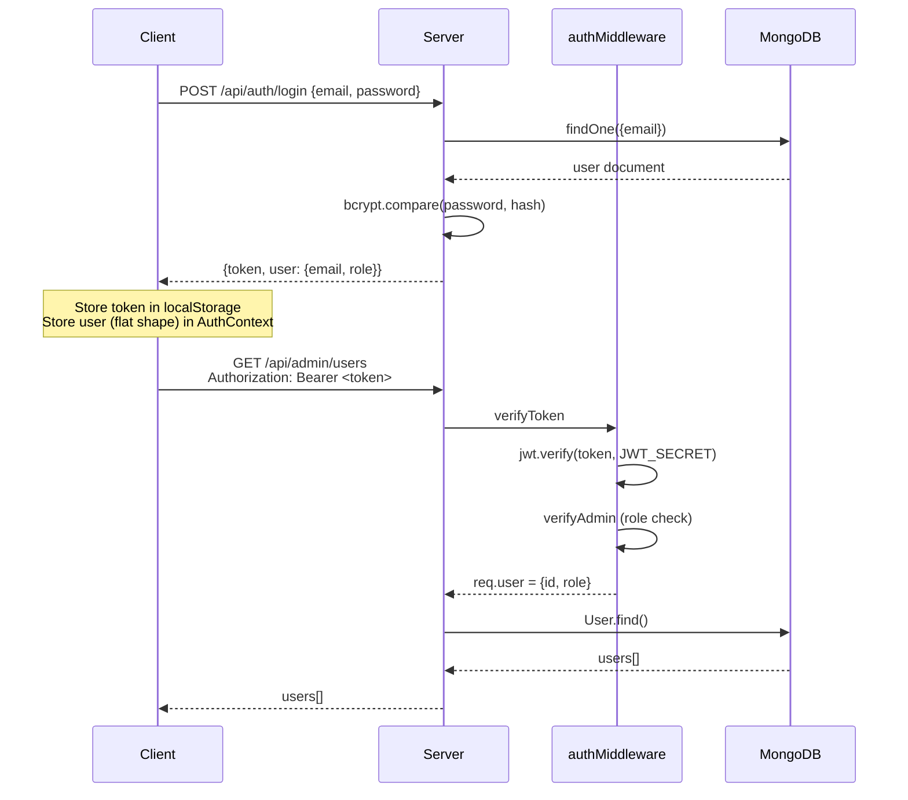

# Design Document: Tourist Safety App Refactor

## Overview

The Tourist Safety App is a full-stack real-time safety platform for tourists, built with React 19 + Vite on the frontend and Node.js + Express + MongoDB on the backend. The current codebase has 19 identified issues spanning security vulnerabilities, broken architecture, hardcoded values, and missing implementations. This refactor resolves all of them to produce a clean, production-ready application.

The refactor does not change the product's feature set — live location sharing, risk zone heatmaps, emergency alerts, nearby hospital/police discovery, AI chatbot, and admin tracking dashboard all remain. The goal is correctness, security, and maintainability.

---

## Architecture

### High-Level System Architecture

```mermaid
graph TD
    subgraph Client ["Client (React 19 + Vite)"]
        A[main.jsx<br/>AuthProvider wrapper] --> B[App.jsx<br/>Routes + Maps loader]
        B --> C[ProtectedRoute]
        C --> D[UserDashboard]
        C --> E[MapPage]
        C --> F[AdminDashboard]
        B --> G[Login / Register]
        B --> H[TrackUser - public]
    end

    subgraph Services ["Client Services Layer"]
        I[api.js<br/>Axios instance<br/>baseURL = VITE_API_URL]
        J[authService.js]
        K[locationService.js]
        L[alertService.js]
        M[aiService.js]
    end

    subgraph Server ["Server (Express + MongoDB)"]
        N[server.js] --> O[CORS - origin whitelist]
        N --> P[/api/auth]
        N --> Q[/api/location]
        N --> R[/api/alert]
        N --> S[/api/ai]
        N --> T[/api/admin]
        N --> U[config/db.js]
    end

    subgraph Middleware
        V[verifyToken]
        W[verifyAdmin]
    end

    subgraph DB ["MongoDB"]
        X[User]
        Y[Location]
        Z[Alert]
    end

    Client --> Services
    Services --> Server
    Server --> Middleware
    Middleware --> DB
```

### Request Authentication Flow



---

## Components and Interfaces

### 1. `config/db.js` (Backend — currently empty)

**Purpose**: Encapsulate MongoDB connection logic, removing it from `server.js`.

**Interface**:
```javascript
// config/db.js
const connectDB = async () => Promise<void>
export default connectDB
```

**Responsibilities**:
- Call `mongoose.connect(process.env.MONGO_URI)`
- Log success or throw on failure
- Called once from `server.js` at startup

---

### 2. `server.js` (Backend — refactored)

**Purpose**: Application entry point. Wires middleware, routes, and DB connection.

**Key changes**:
- Remove `console.log("ENV KEY:", ...)` debug line
- Replace `app.use(cors())` with origin-restricted CORS
- Replace inline `mongoose.connect(...)` with `connectDB()` from `config/db.js`
- Register `adminRoutes` (currently missing)

**Interface**:
```javascript
// CORS config
const corsOptions = {
  origin: process.env.CLIENT_ORIGIN || "http://localhost:5173",
  credentials: true
}
app.use(cors(corsOptions))
```

---

### 3. `authController.js` (Backend — security fix)

**Purpose**: Handle registration and login. Remove ability to self-register as admin.

**Key changes**:
- Strip `role` from `req.body` during registration — always default to `"user"`
- Add email format validation
- Add minimum password length check

**Interface**:
```javascript
export const register = async (req, res) => {
  // role is NEVER taken from req.body
  const { email, password } = req.body
  // validate email format, password length
  // create user with role: "user" always
}

export const login = async (req, res) => {
  // role param from body is used only for client-side routing hint
  // actual role comes from DB record
}
```

---

### 4. `adminController.js` (Backend — currently empty)

**Purpose**: Admin-only operations: list all users, delete a user, resolve an alert.

**Interface**:
```javascript
export const getAllUsers = async (req, res) => Promise<void>
export const deleteUser  = async (req, res) => Promise<void>
export const resolveAlert = async (req, res) => Promise<void>
```

**Responsibilities**:
- `getAllUsers`: Return all users (excluding password field)
- `deleteUser`: Delete user by ID, also remove their location record
- `resolveAlert`: Mark an alert as resolved (add `resolved: Boolean` to Alert schema)

---

### 5. `adminRoutes.js` (Backend — currently empty)

**Purpose**: Mount admin controller behind `verifyToken + verifyAdmin` middleware.

**Interface**:
```javascript
router.get("/users",          verifyToken, verifyAdmin, getAllUsers)
router.delete("/users/:id",   verifyToken, verifyAdmin, deleteUser)
router.patch("/alerts/:id/resolve", verifyToken, verifyAdmin, resolveAlert)
```

---

### 6. `User.js` Model (Backend — add validation)

**Purpose**: Mongoose schema for users with proper field constraints.

**Key changes**:
- Add `required: true` to `email` and `password`
- Add email format validation via `match` regex
- Add `minlength` to password (hashed, so enforce on plain text in controller)
- Add `name` field (used in Register form but missing from schema)

**Interface**:
```javascript
const userSchema = new mongoose.Schema({
  name:     { type: String, trim: true },
  email:    { type: String, required: true, unique: true, lowercase: true, match: /email-regex/ },
  password: { type: String, required: true },
  role:     { type: String, enum: ["user", "admin"], default: "user" }
})
```

---

### 7. `api.js` (Frontend — centralized Axios instance)

**Purpose**: Single Axios instance used by ALL services, not just auth.

**Key changes**:
- `baseURL` set to `import.meta.env.VITE_API_URL` (e.g. `http://localhost:5000/api`)
- Attach JWT token via request interceptor
- Handle 401 responses via response interceptor (auto-logout)

**Interface**:
```javascript
const api = axios.create({
  baseURL: import.meta.env.VITE_API_URL ?? "http://localhost:5000/api"
})

// Request interceptor: attach token
api.interceptors.request.use(config => {
  const token = localStorage.getItem("token")
  if (token) config.headers.Authorization = `Bearer ${token}`
  return config
})

// Response interceptor: handle 401
api.interceptors.response.use(
  res => res,
  err => {
    if (err.response?.status === 401) { /* logout */ }
    return Promise.reject(err)
  }
)

export default api
```

---

### 8. Service Modules (Frontend — new files)

**Purpose**: Replace scattered `axios.get("http://localhost:5000/...")` calls with typed service functions.

```javascript
// services/locationService.js
export const updateLocation = (userId, lat, lng) =>
  api.post("/location/update", { userId, lat, lng })

export const getAllLocations = () =>
  api.get("/location/all")

export const getUserLocation = (userId) =>
  api.get(`/location/${userId}`)

export const stopSharing = (userId) =>
  api.post("/location/stop", { userId })

// services/alertService.js
export const createAlert = (userId, lat, lng) =>
  api.post("/alert/create", { userId, lat, lng })

export const getAlerts = () =>
  api.get("/alert/all")

// services/aiService.js
export const chatWithAI = (message, location) =>
  api.post("/ai/chat", { message, location })
```

---

### 9. `AuthContext.jsx` (Frontend — fix auth state shape)

**Purpose**: Provide consistent flat user shape throughout the app.

**Key changes**:
- `login(data)` stores `data.user` (flat) — already correct in context, but `UserDashboard` accesses `user?.user?.email` (double-nested). Fix: ensure `setUser(data.user)` and update all consumers to use `user?.email`.
- `ProtectedRoute` currently checks `user.user.role` — fix to `user.role`.

**Interface**:
```javascript
// Shape stored in context and localStorage:
// { email: string, role: "user" | "admin" }

const login = (data) => {
  setUser(data.user)                              // flat shape
  localStorage.setItem("userData", JSON.stringify(data.user))
  localStorage.setItem("token", data.token)
}
```

---

### 10. `ProtectedRoute.jsx` (Frontend — fix role check + wire into App.jsx)

**Purpose**: Guard routes by authentication and optional role.

**Key changes**:
- Fix `user.user.role` → `user.role`
- Wire into `App.jsx` for `/dashboard`, `/map`, `/admin`

**Interface**:
```jsx
const ProtectedRoute = ({ children, role }) => {
  const { user } = useAuth()
  if (!user) return <Navigate to="/" replace />
  if (role && user.role !== role) return <Navigate to="/" replace />
  return children
}
```

**App.jsx wiring**:
```jsx
<Route path="/dashboard" element={
  <ProtectedRoute><UserDashboard /></ProtectedRoute>
} />
<Route path="/map" element={
  <ProtectedRoute><MapPage /></ProtectedRoute>
} />
<Route path="/admin" element={
  <ProtectedRoute role="admin"><AdminDashboard /></ProtectedRoute>
} />
```

---

### 11. `Register.jsx` (Frontend — remove role selection)

**Purpose**: Registration form should not expose role selection to users.

**Key changes**:
- Remove the `<select>` for role — backend always assigns `"user"`
- Add loading state and error display

---

### 12. `MapPage.jsx` (Frontend — remove hardcoded URL, remove unused useMemo)

**Key changes**:
- Replace `axios.post("http://localhost:5000/api/location/stop", ...)` with `stopSharing(id)` from `locationService`
- Remove `const libraries = useMemo(...)` — libraries are already loaded in `App.jsx`

---

### 13. `MapView.jsx` (Frontend — risk zones from backend, replace Math.random)

**Key changes**:
- Risk zone heatmap data fetched from `GET /api/location/risk-zones` (new endpoint) or from env config, not hardcoded lat/lng
- Safety score: replace `Math.floor(Math.random() * 40) + 60` with a deterministic hash of the place's `placeId` to produce a stable score in range 60–99
- Replace `axios.post("http://localhost:5000/api/alert/create", ...)` with `createAlert()` from `alertService`

**Safety score algorithm**:
```javascript
// Deterministic score from placeId string
const safetyScore = (placeId) => {
  let hash = 0
  for (let i = 0; i < placeId.length; i++) {
    hash = (hash * 31 + placeId.charCodeAt(i)) & 0xffffffff
  }
  return 60 + (Math.abs(hash) % 40)  // range: 60–99
}
```

---

### 14. `useAllLocations.js` and `useLiveLocation.js` (Frontend — use service layer)

**Key changes**:
- Replace direct `axios.get("http://localhost:5000/...")` with service functions
- Add error state to `useAllLocations`

---

### 15. `AdminDashboard.jsx` (Frontend — use service layer)

**Key changes**:
- Replace `axios.get("http://localhost:5000/api/alert/all")` with `getAlerts()` from `alertService`
- Add loading and error states

---

### 16. `TrackUser.jsx` (Frontend — use service layer)

**Key changes**:
- Replace `axios.get(\`http://localhost:5000/api/location/${userId}\`)` with `getUserLocation(userId)` from `locationService`

---

### 17. `Chatbot.jsx` (Frontend — use service layer)

**Key changes**:
- Replace `axios.post("http://localhost:5000/api/ai/chat", ...)` with `chatWithAI()` from `aiService`

---

### 18. `UserDashboard.jsx` (Frontend — fix double-nested user access)

**Key changes**:
- Change `user?.user?.email` → `user?.email`

---

### 19. Error Boundary + 404 Route (Frontend — new)

**Purpose**: Catch unhandled render errors and handle unknown routes.

```jsx
// components/ErrorBoundary.jsx
class ErrorBoundary extends React.Component {
  state = { hasError: false }
  static getDerivedStateFromError() { return { hasError: true } }
  render() {
    if (this.state.hasError) return <ErrorFallback />
    return this.props.children
  }
}

// App.jsx — catch-all route
<Route path="*" element={<NotFound />} />
```

---

## Data Models

### User

```javascript
{
  name:      String (optional, trimmed),
  email:     String (required, unique, lowercase, validated format),
  password:  String (required, bcrypt hash),
  role:      "user" | "admin" (default: "user", never user-supplied on register)
}
```

### Location

```javascript
{
  userId:    String (required),
  lat:       Number (required),
  lng:       Number (required),
  updatedAt: Date (default: now),
  isSharing: Boolean (default: true)
}
```

### Alert

```javascript
{
  userId:    String (required),
  lat:       Number (required),
  lng:       Number (required),
  resolved:  Boolean (default: false),   // NEW field
  createdAt: Date (default: now)
}
```

---

## Algorithmic Pseudocode

### Registration Security Fix

```pascal
PROCEDURE register(req, res)
  INPUT: req.body = { email, password, name? }
  OUTPUT: HTTP response

  SEQUENCE
    // NEVER read role from req.body
    { email, password, name } ← req.body

    IF email IS NULL OR password IS NULL THEN
      RETURN res.status(400).json({ message: "All fields required" })
    END IF

    IF NOT isValidEmail(email) THEN
      RETURN res.status(400).json({ message: "Invalid email format" })
    END IF

    IF password.length < 6 THEN
      RETURN res.status(400).json({ message: "Password too short" })
    END IF

    existing ← User.findOne({ email: email.toLowerCase() })

    IF existing IS NOT NULL THEN
      RETURN res.status(400).json({ message: "User already exists" })
    END IF

    hash ← bcrypt.hash(password, 10)

    user ← User.create({
      name,
      email: email.toLowerCase(),
      password: hash,
      role: "user"   // HARDCODED — never from input
    })

    RETURN res.status(201).json({ message: "Registered", user: { email, role: "user" } })
  END SEQUENCE
END PROCEDURE
```

**Preconditions:**
- `req.body` contains `email` and `password`
- `role` field in `req.body` is silently ignored

**Postconditions:**
- Created user always has `role = "user"`
- Password stored as bcrypt hash, never plaintext
- Email stored lowercase

**Loop Invariants:** N/A

---

### Deterministic Safety Score

```pascal
FUNCTION safetyScore(placeId)
  INPUT: placeId: String
  OUTPUT: score: Integer in [60, 99]

  SEQUENCE
    hash ← 0

    FOR each character c IN placeId DO
      hash ← (hash * 31 + charCode(c)) BITAND 0xFFFFFFFF
    END FOR

    score ← 60 + (ABS(hash) MOD 40)

    RETURN score
  END SEQUENCE
END FUNCTION
```

**Preconditions:**
- `placeId` is a non-empty string (Google Places ID)

**Postconditions:**
- Same `placeId` always returns the same score (deterministic)
- Score is always in range [60, 99]

**Loop Invariants:**
- `hash` is always a 32-bit integer after each iteration

---

### Centralized API Client with Auth Interceptor

```pascal
PROCEDURE setupApiInterceptors(apiInstance)
  INPUT: apiInstance (Axios instance)

  SEQUENCE
    // Request interceptor
    apiInstance.interceptors.request.use(
      FUNCTION(config)
        token ← localStorage.getItem("token")
        IF token IS NOT NULL THEN
          config.headers.Authorization ← "Bearer " + token
        END IF
        RETURN config
      END FUNCTION
    )

    // Response interceptor
    apiInstance.interceptors.response.use(
      FUNCTION(response) RETURN response END FUNCTION,
      FUNCTION(error)
        IF error.response.status = 401 THEN
          localStorage.removeItem("token")
          localStorage.removeItem("userData")
          window.location ← "/"
        END IF
        RETURN Promise.reject(error)
      END FUNCTION
    )
  END SEQUENCE
END PROCEDURE
```

**Preconditions:**
- `apiInstance` is a valid Axios instance
- `localStorage` is available

**Postconditions:**
- Every outgoing request includes `Authorization` header if token exists
- 401 responses trigger automatic logout and redirect

---

### Admin Controller: getAllUsers

```pascal
PROCEDURE getAllUsers(req, res)
  INPUT: req.user = { id, role: "admin" }  // set by verifyToken + verifyAdmin
  OUTPUT: HTTP response

  SEQUENCE
    users ← User.find({}).select("-password")

    RETURN res.json(users)
  END SEQUENCE
END PROCEDURE
```

**Preconditions:**
- `verifyToken` and `verifyAdmin` middleware have already run
- `req.user.role === "admin"`

**Postconditions:**
- Returns array of user objects without `password` field
- No side effects

---

## Key Functions with Formal Specifications

### `connectDB()` — `config/db.js`

```javascript
const connectDB = async () => void
```

**Preconditions:**
- `process.env.MONGO_URI` is set and non-empty

**Postconditions:**
- On success: mongoose connection is open, logs "MongoDB Connected"
- On failure: logs error and `process.exit(1)`

---

### `verifyToken(req, res, next)` — `middleware/authMiddleware.js`

```javascript
const verifyToken = (req, res, next) => void
```

**Preconditions:**
- `req.headers.authorization` may or may not be present

**Postconditions:**
- If missing: responds 403
- If invalid/expired: responds 401
- If valid: sets `req.user = { id, role }` and calls `next()`

---

### `safetyScore(placeId: string): number`

**Preconditions:**
- `placeId` is a non-empty string

**Postconditions:**
- Returns integer in [60, 99]
- Deterministic: same input always returns same output
- No side effects

---

## Error Handling

### Scenario 1: Unauthenticated Access to Protected Route

**Condition**: User navigates to `/dashboard` or `/map` without a valid session  
**Response**: `ProtectedRoute` redirects to `/` (login page)  
**Recovery**: User logs in and is redirected to appropriate page

### Scenario 2: Expired JWT Token

**Condition**: API call returns 401  
**Response**: Axios response interceptor clears localStorage, redirects to `/`  
**Recovery**: User re-authenticates

### Scenario 3: MongoDB Connection Failure

**Condition**: `connectDB()` throws  
**Response**: Server logs error and exits with code 1  
**Recovery**: Process manager (e.g. PM2) restarts the server

### Scenario 4: Self-Registration as Admin Attempt

**Condition**: `POST /api/auth/register` body contains `role: "admin"`  
**Response**: `role` field is silently ignored; user created with `role: "user"`  
**Recovery**: N/A — attack is neutralized by design

### Scenario 5: Unknown Route

**Condition**: User navigates to a path not defined in `App.jsx`  
**Response**: Catch-all `<Route path="*">` renders `<NotFound />` component  
**Recovery**: User is shown a 404 page with a link back to home

### Scenario 6: Render Error in Component Tree

**Condition**: Unhandled JavaScript error during React render  
**Response**: `ErrorBoundary` catches it and renders a fallback UI  
**Recovery**: User can refresh or navigate away

---

## Testing Strategy

### Unit Testing Approach

Test pure utility functions and controller logic in isolation:
- `safetyScore(placeId)` — verify determinism and range [60, 99]
- `register` controller — verify `role` is always `"user"` regardless of input
- `authMiddleware.verifyToken` — test missing token, invalid token, valid token
- `authMiddleware.verifyAdmin` — test non-admin rejection

### Property-Based Testing Approach

**Property Test Library**: fast-check (frontend), or jest-fast-check (backend)

Key properties to verify:
- For all non-empty strings `s`, `safetyScore(s)` is in [60, 99]
- For all non-empty strings `s`, `safetyScore(s) === safetyScore(s)` (determinism)
- For all registration payloads `p`, the created user always has `role === "user"` regardless of `p.role`
- For all valid JWTs signed with `JWT_SECRET`, `verifyToken` calls `next()` exactly once

### Integration Testing Approach

- `POST /api/auth/register` with `role: "admin"` → created user has `role: "user"`
- `GET /api/admin/users` without token → 403
- `GET /api/admin/users` with user token → 403
- `GET /api/admin/users` with admin token → 200 with user list
- `POST /api/auth/login` with wrong password → 400

---

## Security Considerations

| Issue | Fix |
|---|---|
| Wide-open CORS | Restrict to `CLIENT_ORIGIN` env var |
| API key logged to console | Remove `console.log("ENV KEY:", ...)` |
| Self-registration as admin | Strip `role` from register body |
| No email validation | Add `match` regex to User schema + controller check |
| Unprotected routes | Wire `ProtectedRoute` in `App.jsx` |
| Token not attached to requests | Axios request interceptor in `api.js` |
| Debug `console.log` in components | Remove all debug logs |

---

## Performance Considerations

- `useAllLocations` polls every 5 seconds — acceptable for MVP; consider WebSocket upgrade for production
- `useLiveLocation` sends geolocation every 5 seconds — add debounce if GPS accuracy is low
- `AdminDashboard` polls alerts every 3 seconds — same consideration
- `libraries` array in `App.jsx` is already stable (defined at module level), so `useMemo` in `MapPage` is correctly identified as redundant and should be removed

---

## Dependencies

No new dependencies are required. All fixes use existing packages:
- `express`, `cors`, `mongoose`, `bcryptjs`, `jsonwebtoken`, `dotenv` (backend)
- `axios`, `react-router-dom`, `@react-google-maps/api`, `framer-motion` (frontend)

New environment variables needed:
- `CLIENT_ORIGIN` (server) — allowed CORS origin, e.g. `http://localhost:5173`
- `VITE_API_URL` (client) — base API URL, e.g. `http://localhost:5000/api`

---

## Correctness Properties

*A property is a characteristic or behavior that should hold true across all valid executions of a system — essentially, a formal statement about what the system should do. Properties serve as the bridge between human-readable specifications and machine-verifiable correctness guarantees.*

### Property 1: Role Immutability on Registration

For any registration request payload — regardless of what value the `role` field contains (including `"admin"`, `"superuser"`, or any arbitrary string) — the user created in the database SHALL always have `role === "user"`.

**Validates: Requirements 3.1**

---

### Property 2: Safety Score Range and Determinism

For any non-empty string `placeId`, `safetyScore(placeId)` SHALL return an integer in the closed range [60, 99], and calling `safetyScore(placeId)` multiple times with the same input SHALL always return the same value.

**Validates: Requirements 11.1, 11.2**

---

### Property 3: Password Never Stored as Plaintext

For any valid registration payload with a plaintext password `p`, the value stored in the database for that user's `password` field SHALL NOT equal `p`, and SHALL pass `bcrypt.compare(p, storedHash)`.

**Validates: Requirements 3.4**

---

### Property 4: JWT Token Attached to All Authenticated Requests

For any JWT token string stored in localStorage, every outgoing request made through the API_Client SHALL include an `Authorization` header with the value `"Bearer <token>"`.

**Validates: Requirements 5.2**

---

### Property 5: Admin Endpoints Reject Non-Admin Users

For any request to any `/api/admin/*` endpoint made with a valid JWT token belonging to a user with `role === "user"`, the server SHALL respond with a 403 status and SHALL NOT return any data.

**Validates: Requirements 16.4**

---

### Property 6: getAllUsers Never Exposes Passwords

For any state of the User collection, the response from `getAllUsers` SHALL contain zero user objects that include a `password` field.

**Validates: Requirements 16.2**

---

### Property 7: deleteUser Cascades to Location Records

For any user ID that has an associated location record, calling `deleteUser` with that ID SHALL result in both the user document and the location document being absent from the database.

**Validates: Requirements 16.3**

---

### Property 8: Email Stored as Lowercase

For any registration request with an email string `e` (regardless of case), the email stored in the database SHALL equal `e.toLowerCase()`.

**Validates: Requirements 4.3**

---

### Property 9: ProtectedRoute Redirects Unauthenticated Users

For any route wrapped in ProtectedRoute, rendering that route without an authenticated user in AuthContext SHALL result in a redirect to `"/"` and SHALL NOT render the protected component.

**Validates: Requirements 8.1, 8.2**
